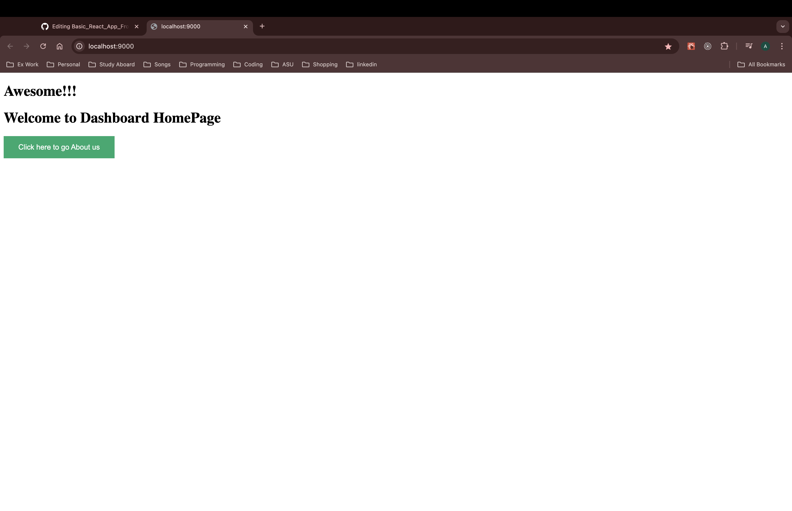
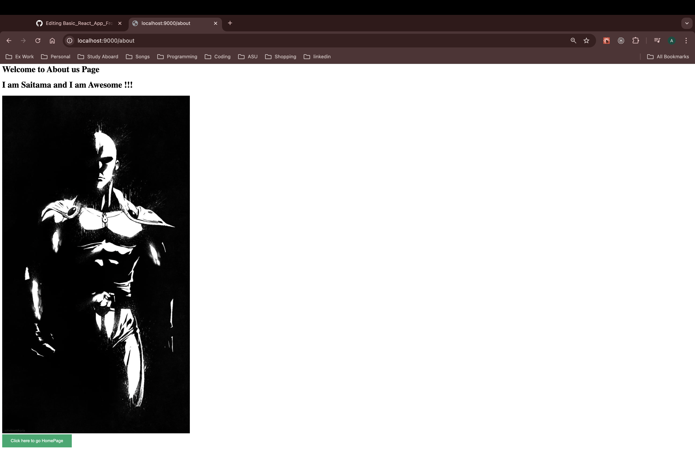

# Basic React App From Scratch With React-Router 6

Basic React App using React, React-Router 6, WebPack 5 and Babel.

## Getting Started

These instructions will get you a copy of the project up and running on your local machine for development and testing purposes. See running for notes on how to run the project on a system.

### Prerequisites

1. Clone the project to your local environment:
    ```
    git clone https://github.com/ankitrajput0096/Basic_React_App_From_Scratch_With_React_Router_6
    ```

2. You need npm to be installed:

    #### Get npm from here:
    https://www.npmjs.com/get-npm

### Installing

Once you have npm installed on your environment, install the project dependencies via:

Installing dependencies:

```
npm install
```

Or 

Install dependencies individually as follows:

```
npm install react react-dom
npm install express
npm install react-router-dom
npm install webpack webpack-cli webpack-dev-server babel-loader @babel/core @babel/preset-env @babel/preset-react html-webpack-plugin --save-dev
npm install style-loader css-loader file-loader --save-dev
```

Start App :

```
npm start
```

Start App in Dev Environment:

```
npm run dev
```

To Bundle App for Prod Environment:

```
npm run prodBundle
```


## Running

Start App in Dev Environment:

```
npm run dev
```

Your application should be now running on http://localhost:9000


Start App in Prod Environment:

```
npm run fireTheProd
```

Your application should be now running on http://localhost:9090

## Screenshots of Simple React App



## Built With

* [React](https://reactjs.org/) - React
* [WebPack](https://webpack.js.org/) - WebPack
* [Babel](https://babeljs.io/) - Babel
* [Express](https://expressjs.com/) - ExpressJS

## Contributing

If you have any improvement suggestions please create a pull request and I'll review it.


## Authors

* **Ankit Rajput** - *Initial work* - [Github](https://github.com/ankitrajput0096)

## License

This project is licensed under the MIT License

## Acknowledgments

* Big thanks to facebook for React.
